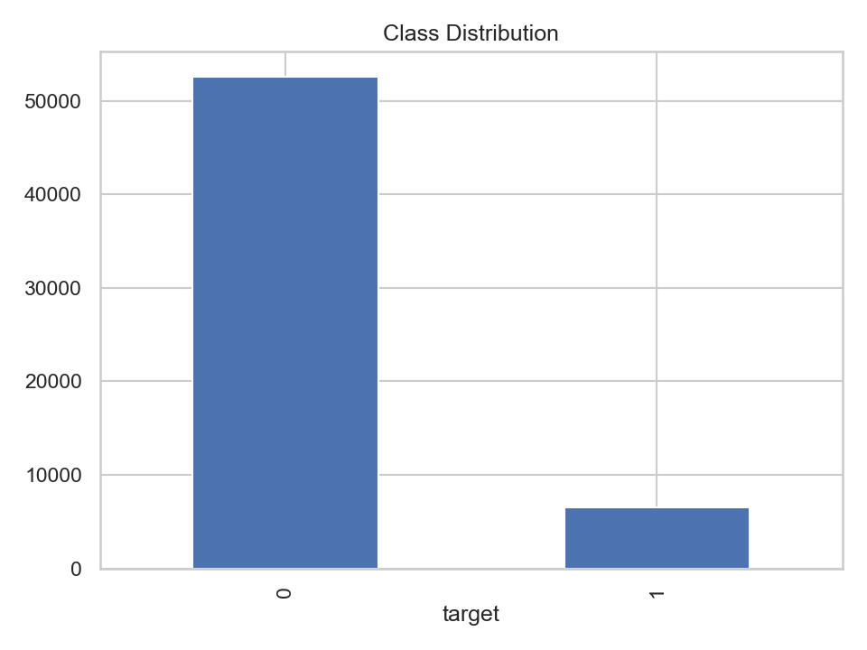
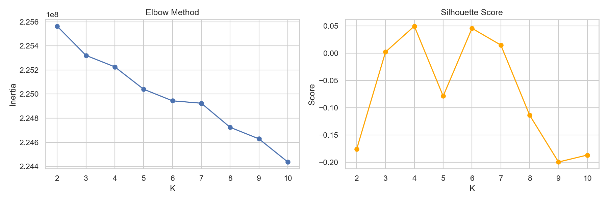
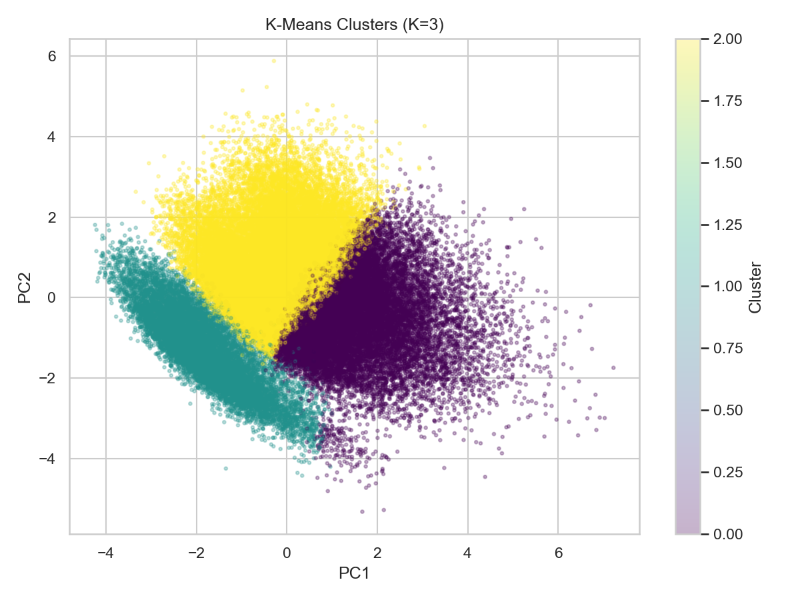
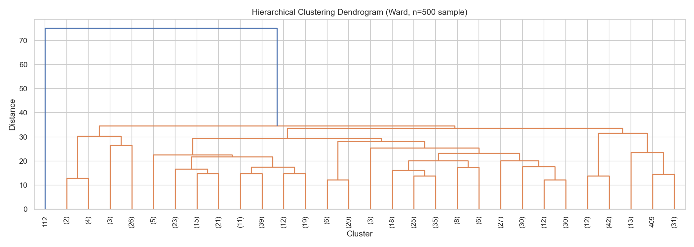
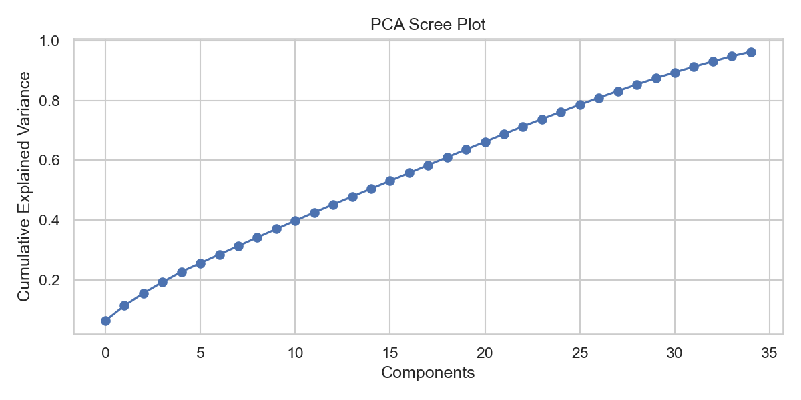
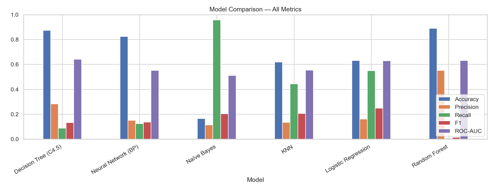
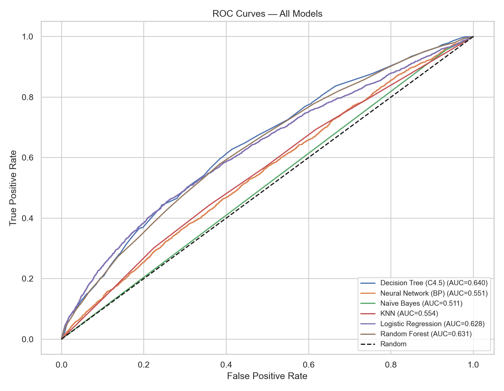
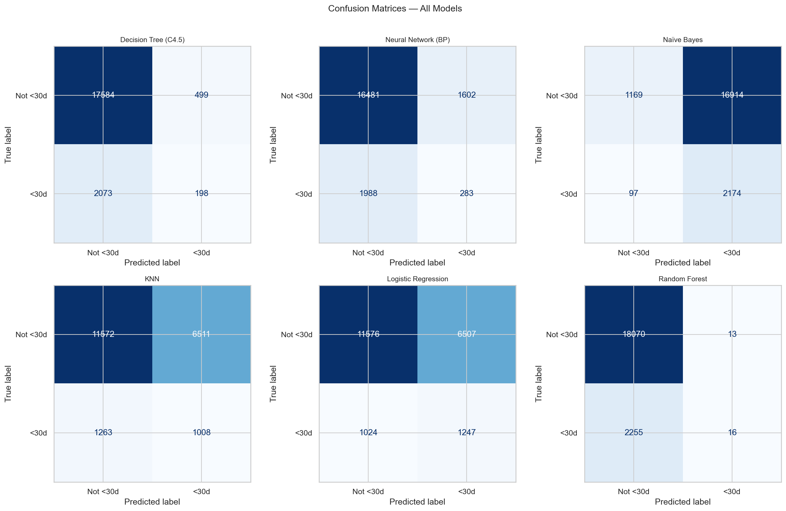

# Hospital Readmission Prediction

Predicting 30-day diabetic patient readmissions using a full data mining pipeline — clustering, classification, and association rule mining on 101,766 real hospital encounters.

**MIS 637 B — Data Mining · Stevens Institute of Technology · Spring 2025**

| | |
|---|---|
| **Group 7** | Sujay Bhagawan Ghadge · Aditya Singh · Rishi Chhabra · Purva Sarode |
| **Dataset** | [Diabetes 130-US Hospitals (UCI ML Repository)](https://archive.ics.uci.edu/dataset/296) |
| **Stack** | Python · scikit-learn · XGBoost · imbalanced-learn · mlxtend |

---

## The Problem

Hospital readmissions within 30 days cost the U.S. healthcare system roughly **$26 billion per year**. If a model can flag high-risk diabetic patients before discharge, clinicians can intervene early and potentially prevent that readmission.

The dataset has a natural difficulty: only **11.2% of encounters are positive class** (`<30d` readmission). Any model that blindly predicts "not readmitted" hits 88.8% accuracy — and catches exactly zero high-risk patients. The real challenge is building something that actually works on the minority class.

---

## Dataset

101,766 patient encounters from 130 U.S. hospitals, 1999–2008.

| Property | Value |
|---|---|
| Records | 101,766 |
| Features | 50 (demographics, diagnoses, medications, visit history) |
| Target | `readmitted` — binarized to `1 = <30 days`, `0 = otherwise` |
| Class split | 11.2% positive · 88.8% negative |
| Source | [archive.ics.uci.edu/dataset/296](https://archive.ics.uci.edu/dataset/296) |



---

## Project Structure

```
hospital-readmission/
├── notebooks/
│   └── MIS637_Hospital_Readmission_Project_Final.ipynb
├── outputs/
│   ├── figures/          ← all plots (auto-saved by notebook)
│   └── models/           ← trained model pickles
├── data/
│   └── diabetic_data.csv ← auto-downloaded if missing
├── requirements.txt
└── README.md
```

---

## Setup

```bash
git clone https://github.com/rchhabra13/hospital-readmission.git
cd hospital-readmission

python3 -m venv .venv
source .venv/bin/activate

pip install -r requirements.txt
jupyter notebook notebooks/MIS637_Hospital_Readmission_Project_Final.ipynb
```

The notebook installs its own dependencies (Cell 1) and downloads the dataset automatically if `data/diabetic_data.csv` is not found — no manual setup required. Works on Google Colab too.

---

## Pipeline

### Phase 1 — Preprocessing

- Missing values encoded as `'?'` — replaced with `NaN`, columns >40% missing dropped (`weight`, `payer_code`, `medical_specialty`)
- Remaining NaN imputed: median for numeric, mode for categorical — **all 101,766 rows preserved**
- Age bracket → ordinal integer (0–9); nominal columns (`race`, `gender`, `diag_1/2/3`) → one-hot encoded
- 5 engineered features: `total_visits`, `medication_per_day`, `lab_per_day`, `diag_med_ratio`, `prior_inpatient_flag`
- Leakage-free pipeline: split → fit scaler on train → SMOTE on train → fit PCA on train

### Phase 2 — Clustering

K = 4 detected automatically via the second-derivative elbow method. Four natural patient risk groups emerged.





| Cluster | Patients | Readmission Rate |
|---|---|---|
| 0 | 52,017 | 8.15% |
| 1 | 85 | 5.88% |
| 2 | 3 | 0.00% |
| **3** | **49,661** | **14.33% ← highest risk** |

Hierarchical clustering (Ward linkage, 200-patient sample) confirmed the same natural groupings.



### Phase 3 — Classification

7 classifiers trained with `class_weight='balanced'` and SMOTE on the training fold. Each model's decision threshold is optimized independently (maximizing F1) rather than using a fixed 0.5 cutoff.



### Phase 4 — Association Rules

Apriori run on the `<30d` readmission subset to discover frequent medication co-occurrence patterns.

- **25** frequent itemsets · **35** rules
- Thresholds: support ≥ 0.10 · confidence ≥ 0.60 · lift ≥ 1.20
- Top rule: `metformin → {diabetesMed_Yes, medication_changed}` — Support 0.135 · Confidence 0.793 · Lift 1.621

### Phase 5 — Evaluation







---

## Results

| Model | Accuracy | Precision | Recall | F1 | ROC-AUC | Threshold |
|---|---|---|---|---|---|---|
| Decision Tree (C4.5) | 68.7% | 0.166 | 0.449 | 0.243 | 0.607 | 0.578 |
| Neural Network (BP) | 46.7% | 0.127 | 0.639 | 0.211 | 0.553 | 0.003 |
| Naïve Bayes | 11.6% | 0.112 | **0.997** | 0.201 | 0.516 | 0.000 |
| kNN (k=3) | 54.5% | 0.131 | 0.545 | 0.211 | 0.549 | 0.333 |
| **Logistic Regression** | 70.4% | **0.183** | 0.477 | **0.264** | **0.640** | 0.541 |
| Random Forest | 68.5% | 0.171 | 0.472 | 0.251 | 0.632 | 0.496 |
| XGBoost | **74.2%** | 0.177 | 0.361 | 0.238 | 0.608 | 0.886 |

**Logistic Regression** is the recommended model — best F1 (0.264) and ROC-AUC (0.640) across all seven classifiers.

**XGBoost** has the highest raw accuracy (74.2%) but its optimal threshold (0.886) is very conservative — it only catches 36% of actual readmissions, making it less useful as a screening tool.

**Naïve Bayes** hits near-perfect Recall (99.7%) by flagging almost everyone as positive — its 11.6% accuracy is essentially the base rate, so it adds no real discriminative value.

The ceiling across all models (F1 ~0.26, AUC ~0.64) is consistent with published results on this dataset and reflects the absence of clinical notes, lab trends, and social determinants in administrative EHR data.

---

## Tech Stack

| | |
|---|---|
| **Language** | Python 3 |
| **Data** | pandas, numpy |
| **ML** | scikit-learn, XGBoost, imbalanced-learn (SMOTE) |
| **Association Rules** | mlxtend |
| **Visualization** | matplotlib, seaborn |
| **Clustering** | scikit-learn (KMeans, Agglomerative), scipy (dendrogram) |

---

## References

- Strack, B. et al. (2014). *Impact of HbA1c Measurement on Hospital Readmission Rates.* BioMed Research International.
- Chawla, N.V. et al. (2002). *SMOTE: Synthetic Minority Over-sampling Technique.* JAIR.
- UCI ML Repository — [Diabetes 130-US Hospitals Dataset](https://archive.ics.uci.edu/dataset/296)

---

*MIS 637 B · Stevens Institute of Technology · Spring 2026*
